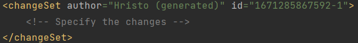
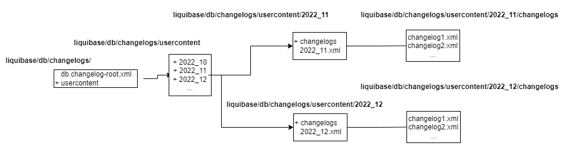

<h1 style="text-align: center;"> Liquibase Integration for Inverso BackEnds</h1>

***

## 1. Introduction to Liquibase
<div align="justify">
<strong>Liquibase</strong> is a database version control library which helps developers and database administrators (DBAs) to evolve easily a database schema by specifying all related changes in files which can be preserved in a distributed version control system e.g. Bitbucket, Github. It is written in the Java programming language and is suitable for Java-based projects e.g. Maven, Gradle, Spring Boot etc. With the help of Liquibase, it is no more required to perform any database changes directly on the database server, but instead from any project where Liquibase is introduced into. The supported file formats include XML, JSON, YML and SQL whereas <a href="https://forum.liquibase.org/t/the-magic-of-using-xml-changelogs-in-liquibase/6090" target="_blank" title="The magic of using XML changeLogs in Liquibase">XML</a> is most compact and easy to understand format. This is also the reason why the majority of examples in this document will be presented with the XML syntax.

### 1.1 Elements of Liquibase
The tool comes with some specific concepts, which need to be understood in order to grant some knowledge of how to control the database through files defined in the Back-End projects. The main block i.e. container of changes which is presented in each file is called ```databaseChangeLog``` and similarly files containing it are called ```changelogs```. The following figure visualizes how a XML file should be defined:

<p align="center">
    
</p>
<p align="center">
    <em>Example of a databaseChangeLog tag</em>
</p>

Inside of the databaseChangeLog container can be specified many so-called ```changeSets``` which are also containers holding the actual changes to the database schema. Each changeSet tag has two mandatory attributes - an ```author``` and an ```id``` as presented on the figure below:

<p align="center">
    
</p>
<p align="center">
    <em>Example of a changeSet tag</em>
</p>

As per convention, the author attribute defines who has written the changeSet whereas the id property is related to the unique identificator of the changeSet. However, in the majority of projects, the JIRA ticket number is provided in the id. 

<p align="center">
    
</p>
<p align="center">
    <em>Example of a databaseChangeLog holding many changeSet tags in a XML file</em>
</p>

The final piece of the main concept is the ```change```. It describes each operation which should be executed on the schema. Observing the figure with multiple changeSets can be seen, how SQL operations like ```CREATE TABLE```, ```DROP TABLE``` etc. are represented with XML tags e.g. ```createTable```, ```dropTable``` carrying the same meaning. For the complete set of operations can be referenced [this article](https://docs.liquibase.com/change-types/home.html#entities) from the Liquibase documentation.

:memo: **Note:** Some tags are used e.g. for differentiation between many DBMS platforms, or specifying a context in terms of if-statement when a specific changeLog should be executed. 


### 1.2 File Hierarchy
After all parts of the terminology regarding the changes executed by Liquibase were explained, in the current section will be presented a possible hierarchy of the changeSets during the development of a project and more specifically a Spring Boot project.

Typical location for all changeLog files is the ```resources``` folder of an ordinary Spring Boot project. There could be also found the static files, templates and not on the last place, the application properties. By creating a folder with the name ```liquibase```, all types of files e.g. regarding the configuration or the changes will be collected in one place. 

Following the convention from the Liquibase documentation, the changes should be available under the path ```resources/db/changelogs/```, but since there will be stored many file types, inside of the ```liquibase``` folder will be defined two folders - ```config``` and ```db```. As the name suggests, ```config``` will contain all environment-specific files whereas ```db``` the changeLogs as per convention from the Liquibase official page. Each changeSet can be grouped with other changeSets under one databaseChangeLog tag i.e. in one file, or can be defined alone in a file. The same rule applies for the changes. However, the Liquibase team suggests that only one change should be specified per a changeSet container and the reason for this is that Liquibase attempts to execute each changeSet in a transaction that is comitted at the end, or rolled back if there is an error. Some databases will auto-commit statemets which inteferes with this transaction setup and could lead to an unexpected database state.

Regardless the number of changes executed to a schema for a specific time period, the community has adopted the so-called parent-child style of structure in order to make the tracing of changes easy to understand from anybody in a company. The following figure visualizes one of the most popular structures:

<p align="center">
    
</p>
<p align="center">
    <em>Example of Liquibase changeLogs structure</em>
</p>

Under ```liquibase/db/changelogs/``` are found the ```db.changelog-root.xml``` (known as ```db.changelog-master.xml``` in some articles) and the ```usercontent``` folder. The ```db.changelog-root.xml``` does nothing else but just referecing all other changeLogs i.e. the child changeLogs, which can be found in the ```usercontent``` folder. 

:memo: **Note:** The names ```db.changelog-root.xml``` and ```usercontent``` are not mandatory to be specified with these name forms. Each convention helping the developers, DBAs etc. to understand easier the sequence of applying changes to a schema is welcome. 

The folder ```usercontent``` contains many folders which may group the sets of changes for each month of the year as shown on the figure. For example, a folder ```2022_12``` will contain a single file ```2022_12.xml``` and a folder called ```changelogs``` where all changeLog files for the specified month are stored. The file ```2022_12.xml``` will only point to the ```changelogs``` folder and in the same time will be added to the ```db.changelog-root.xml``` file as presented on the following figure:

<p align="center">
    
</p>
<p align="center">
    <em>Example <code>db.changelog-root.xml</code> file</em>
</p>

By keeping the current changeLog structure and due to the chaining of changeLogs, qualities as easy tracing and execution of changes are optimized.
</div>

## 2. Integration in Spring Boot and Maven
<div align="justify">
With the current chapter, the goal is to understand what are the required steps in order to integrate Liquibase in any Spring Boot project of Inverso with the Maven build automation tool. Meanwhile will be discussed why certain configurations are defined in a specific way and are there any alternatives regarding the decisions.

However, all presented changes are with respect to the three main requirements:
1. All changeLogs specified indirectly in the ```db.changelog-root.xml``` file should be executed on application startup.
2. If there are any changes to the models in the application, a changeLog representing the differences between the local model structure and the database should be generated.
3. Research how the configuration should be specified for several environments.

#### 2.1 Execute changeLogs on Application Startup
Liquibase's purpose is to execute changes when the application starts so the database is up to date with the latest changes performed in a project. So the starting point of changes is the application properties file i.e. ```application.properties (or application.yaml)``` related to the project's configuration. There are already specified the connection parameters for the database e.g. ```spring.datasource.url```, ```spring.datasource.username``` etc. so these remain untouched. In case Hibernate is being used for generating all changes made to the data model of the application when it starts, the first step is to turn this feature off by setting the ```ddl-auto``` property to ```none```:

<p align="center">
    
</p>
<p align="center">
    <em>Example <code>application.yaml</code> file</em>
</p>

As next will be specified a path to the changeLog which will be executed always on startup. With the structure definition from the last chapter, the ```spring.liquibase.change-log``` property will point to the *root (or master)* changeLog file in the liquibase subdirectory. Once the property is specified and the required dependency for it (in the next section) is provided, then Liquibase will always take control when the application starts. If this behaviour is not needed, it can be easily turned off by setting the property ```spring.liquibase.enabled``` to ```false```.

In order to satisfy the first requirement, the [liquibase-core](https://mvnrepository.com/artifact/org.liquibase/liquibase-core) package should be added to the ```dependencies``` section of the ```pom.xml``` file. Note that the specified version is the latest by the time of writing the document.

<p align="center">
    
</p>
<p align="center">
    <em>The liquibase-core dependency</em>
</p>

By introducing it and with the changes in the application properties file, when the app is started for the first time or reloaded, all not yet executed changeLogs will be applied to the database and in parallel will be checked which ones are already presented to the schema. A question may arise how Liquibase tracks the executed from non-executed changes.

<p align="center">
    
</p>
<p align="center">
    <em>Example of a schema in a MySQL database</em>
</p>

On the current figure is presented a picture of all tables in an example schema defined in a MySQL database. The last four tables are part of the business logic of the application whereas the ```databasechangelog``` and ```databasechangeloglock``` are created when the app is started for the first time with all changes discussed so far.

<p align="center">
    
</p>
<p align="center">
    <em>Example of <code>databasechangelog</code> table structure</em>
</p>

Principally, the ```databasechangelog``` table is responsible for keeping track of all executed changeSets by capturing the defined attributes e.g. ```ID```, ```AUTHOR``` etc. in the changeLog file plus adding some new e.g. ```DATEEXECUTED```, ```MD5SUM``` as it can be seen on the figure. Liquibase determines identity of the changeSet not only by ```ID``` or ```ID``` and ```AUTHOR```, but instead based on a value of the fields ```ID```, ```AUTHOR``` and ```FILENAME```, which is stored as a MD5 hash in the ```MD5SUM``` column. The ```FILENAME``` column stores the path of the changeLog file. Among the other columns, the more interesting are ```COMMENTS```, ```TAG```, ```CONTEXTS``` and ```LABELS``` columns. Contexts and labels are properties of a changeSet tag allowing to choose a subset of changeSets to execute at runtime, enabling many different use cases. As pointed in [one](https://www.liquibase.com/blog/contexts-vs-labels#:~:text=If%20you%20want%20to%20describe,If%20so%2C%20use%20labels.) of the Liquibase articles, they differ only in deciding who has the power to specify complex logic: the changeSet author or the deployment manager. ```COMMENTS``` and ```TAGS``` are another form of change type, where the first one is for providing a comment to an existing column and the latter one for "tagging" i.e. creating a checkpoint in the ```databasechangelog``` table (more on this in a subsequent section).

:memo: **Note:** With the changes so far, it is already possible to apply various updates to a database schema. However, in the majority of the cases Liquibase must be added to an already evolved schema and by thus must be taken additional steps. 

As a consequence will be introduced the [liquibase-maven-plugin](https://mvnrepository.com/artifact/org.liquibase/liquibase-maven-plugin) in the ```pom.xml``` file. Liquibase is a CLI-tool and normally must be configured in the system path variables, but since the context of integration is a Spring Boot application with the Maven build automation tool, there exists a Maven plugin for providing the same functionality without bothering any system context. 

<p align="center">
    
</p>
<p align="center">
    <em>The <code>liquibase-maven-plugin</code></em>
</p>

:memo: **Note:** Compared to the liquibase core dependency picture, it can be seen that both of them have a version 4.16.1. The versions of the ```liquibase-core``` dependency and the ```liquibase-maven-plugin``` must be the same.

The plugin has a ```configuration``` property where can be listed all its possible configuration properties e.g. database connection, root-changeLog etc. However, in terms of compactness can be used only the ```propertyFile``` which basically contain the remaining ones in a file named e.g. ```liquibase.properties```.

<p align="center">
    
</p>
<p align="center">
    <em>Example of a <code>liquibase.properties</code> file</code></em>
</p>

Inside of the properties file are defined several fields for multiple features of Liquibase. It can be seen that the ```changeLogFile``` property is again specified, but this time for the plugin configuration. Along with it are provided two other file paths properties, namely ```diffChangeLogFile``` and ```outputChangeLogFile```. The first one is related to the ```diff``` command of the plugin (discussed in the following section) whereas the latter one is for generating a changeLog based on the already defined schema in a database.

After that are provided five fields (```driver```, ```url```, ```username```, ```password```, ```defaultSchemaName```) which are more or less trivial for configuring the connection to the database used in the current project.

The last two parameters are also part of the ```diff``` command.

Before executing any new changeSets on the schema, Liquibase must be aware of the current schema state, which is possible by capturing the schema and providing it as a changeLog as well. In other words, the very first changeLog file will be a collection of changeSets for already created tables. Normally if a changeSet e.g. for creating a table is attempted to be executed after such table already exists but is not acknowledged in the ```databasechangelog``` table, the application will throw an exception on startup by saying ```"Table (table name) already exists"```. However, the idea here is to use these changeSets and synchronize them by not executing them, but instead just register them in the ```databasechangelog``` table.

For generating the current state i.e. *snapshot* of a database, the ```liquibase-maven-plugin``` provides the command ```mvn liquibase:generateChangeLog``` which uses the connection fields from the ```liquibase.properties``` file as well as the ```outputChangeLogFile``` and generates the snapshot changeLog on the specified path in the ```outputChangeLogFile``` property. Once generated, it can be placed under some of the folders containing the changeLogs and then can be referenced by the ```db.changelog-root.xml``` file.

After following these steps comes the moment to synchronize the ```databasechangelog``` table. The action is possible by executing the command ```mvn liquibase:changelogSync```, which will take the current root changeLog and compare it with the schema structure.

:warning: **Warning:** One of the biggest issues related to this command is the path of the changeLog. If you have observed, some of the parameters between the application properties file and ```liquibase.properties``` are the same e.g. ```spring.datasource.url``` in the first and ```url``` in the second. The reason for providing it two times is the fact that in the first case they are used by the Spring Boot application whereas in the latter - they come from the specification of the ```liquibase-maven-plugin``` and thus are used by Maven. Unfortunately, there is no standardization with respect to the property names. So normally in the ```liquibase.properties``` file, all file paths must be relative from the ```src/``` folder e.g. ```changeLogFile=src/main/resources/liquibase/db/changelogs/db.chnagelog-root.xml```, but in the application properties it is specified with the ```classpath``` e.g. ```change-log: "classpath:liquibase/db/changelogs/db.changelog-root.xml"```. So if the ```changeLogFile``` property in the ```liquibase.properties``` is defined as the relative from the ```src/```, after executing ```mvn liquibase:changelogSync``` and attempting to start the application, an exception of type ```The table (table name) already exists``` will stop the process. The reason is that the liquibase maven plugin writes in the ```FILENAME``` column the relative path from ```src/``` but the application uses the ```classpath``` and those are two different paths for Liquibase. So eventually Liquibase will not recognize the executed changeLogs by the command ```changelogSync``` as the those which should be skipped on startup, but instead on statup will think of them as new changeLogs and will attempt to execute them one more time. 

:bulb: **Workarounds:** After researching and testing, they were found two workarounds for this problem:
- The first one is by using the [logicalFilePath](https://docs.liquibase.com/concepts/changelogs/attributes/logicalfilepath.html) attribute to override the file name and path when creating the unique identifier of changeSets. In this way, the ```FILEPATH``` will be same everywhere. 
- A more robust solution is to make Maven search the changeLog not in filesystem, but instead in ```classpath```. Also the prefix ```src/main/resources``` will not be specified in the ```changeLogFile``` property of the ```liquibase.properties``` file and both paths will be the same. For using this functionality of Maven, the ```process-resources``` must be called before executing the ```changelogSync``` command, so all in one would look like the following way ```mvn process-resources liquibase:changelogSync```.

If everything is successfull then the ```databasechangelog``` table should be synchronized with the current schema state and the developers can start defining future changeSets. This concludes the solution for the first requirement.

#### 2.2 Generate diffChangeLog between Local and Database Schema

Normally for defining different tables in a database is used JPA along with classes, representing those tables. With the help of annotations like ```@Entity```, ```@Column```, ```@Id``` etc. and the ```ddl-auto``` property, a schema can be created in principle without performing any actions on the database side. Although it is convenient, there is no history of the performed changes - the reason why Liquibase is introduced. 

Since all modifications are specified in changeSets, after making changes to the models in the project, the same changes should be expressed in a changeLog, so Liquibase can apply them. Instead of doing it manually, the plugin provides an automatic solution, namely the ```diffChangeLog```. 

In the ```liquibase.properties``` file are defined three properties for generating a differences changeLog between the local models and database schema. One of them is ```diffChangeLogFile``` specifying the path and name where it should be generated. Another one is ```referenceDriver``` which is the name of the database driver to connect with and the final property is the ```referenceUrl``` which is nothing else but the source for the comparison i.e. the local schema or described in the Liquibase language as the source database.

Looking at the ```liquibase.properties``` figure, the ```referenceUrl``` attribute is defined on four lines. On the first line after mentioning the driver ```hibernate:spring:``` follows the part for specifying the path to the models folder e.g. ```com.customprojects.springliquibasemysql.models```. Then on the second line is mentioned the dialect depending on the DBMS. Third and fourth lines are basic naming strategies.

However, specifying these properties is not enough to generate a ```diffChangeLog``` file. What really stays behind the genereation is another dependency, namely the [liquibase-hibernate](https://mvnrepository.com/artifact/org.liquibase.ext/liquibase-hibernate5). It should be defined in the ```dependencies``` section of the ```liquibase-maven-plugin``` along with the [spring-boot-starter-data-jpa](https://mvnrepository.com/artifact/org.springframework.boot/spring-boot-starter-data-jpa) dependency e.g.:

<p align="center">
    
</p>
<p align="center">
    <em>liquibase-maven-plugin with dependencies</em>
</p>

:memo: **Note:** The version rule applies here as well i.e. the ```liquibase-hibernate5``` version should match the version of the ```liquibase-maven-plugin```.

Once the configuration is done and some changes are performed to the models, the command ```mvn compile liquibase:diff``` can be executed which will create a ```diffChangeLog``` describing all of the required changes to bring the schema state in the database to the models state in the project. The file can then be stored in the ```usercontent``` folder with an appropriate name, describing the changes and then added as a reference to the ```db.changelog-root.xml``` file so on the next application start or update command execution, Liquibase can process it.

#### 2.3 Configuration for several Environments
So far was introduced all the functionality which can be executed with the help of Liqiubase on a database with a single plugin declaration and single file configuration. Although it is pretty convenient, often there are multiple environments related to a project and as a result there are multiple configuration files, which brings the question how to adapt the same functionality for those multiple environment instances.

The first place where changes must be performed is the application properties file. For the different environments e.g. *prod*, *dev*, *test* etc. will be created a separated file ```application-{environment}.properties/application-{environment}.yaml``` in case such one does not exist yet. Inside of it, there will be specified the connection parameters for the concrete environment and the ```context``` of the changeSets e.g. ```prod```, ```dev``` etc. used for the current environment:

<p align="center">
    
</p>
<p align="center">
    <em>liquibase contexts property</em>
</p>

As shown on the picture, the ```change-log``` property does not change i.e. all changeSets for any context are accessible from the master changeLog file. How the changeSets for the actual environments are structured is a separate discussion. Among the possible ways are either to organize all of the changeSets for a specific environment under a folder with the same name so the path for the ```test``` changeSets can look like ```.../resources/liquibase/db/changelogs/test/...``` or to have all environment changeSets for a particular table change in one changeLog file e.g. 

```
<databaseChangeLog>
    <changeSet id="..." author="..." context="prod">
        ...
    </changeSet>
    <changeSet id="..." author="..." context="dev">
        ...
    </changeSet>
    <changeSet id="..." author="..." context="test">
        ...
    </changeSet>
</databaseChangeLog>
```

:warning: **Warning:** Independent from the choice of structuring, if there are some changeSets with no specified context, Liquibase will execute them always even if some context is provided in the command! So a best practice when working with multiple environments is to specify the context for each changeLog describing a table update.

If Liquibase is enabled on application startup then in order to execute a specific application environment file, the user should either mention it in the ```applicaton-{env}.properties/application-{env}.yaml``` file e.g.:

<p align="center">
    
</p>
<p align="center">
    <em>Spring Boot: Set active profiles thorugh application.yaml</em>
</p>

or set it with the parameter ```-Dspring.profiles.active=dev``` by running the application from the command line.

So far was taken a look into the selection of changeSets to be run on application start and possible ways for instructing Spring Boot how to do it. However, the features related to the usage of the ```liquibase-maven plugin``` discussed so far also undergo changes.

The plugin uses properties for the database connection as well as the different file paths, all of them specified in the ```liquibase.properties``` so in a similar way to the environment-specific application properties file, there will be defined a ```liquibase-{env}.properties``` file. Inside of it, the main changes are related to the different database connection and again mentioning the right ```context```.

<p align="center">
    
</p>
<p align="center">
    <em>Liquibase properties with specified context (here: <code>prod</code>)</em>
</p>

In case there is no timestamp property introduced in the properties section of the ```pom.xml``` file, the following one will be added, representing the timestamp format which will be always attached to the different files generated with the help of the plugin e.g. ```<maven.build.timestamp.format>yyyy-MM-dd'T'HH.mm.ss</maven.build.timestamp.format>```. For allowing all operations to be available environment-specific, there are defined several Maven ```profiles```.

In each of those profiles, the ```maven-liquibase``` plugin will be configured to use a particular liquibase-environment properties file. The following figure presents the changes to the plugin configuration for the ```test``` environment.

<p align="center">
    
</p>
<p align="center">
    <em>Modified configuration of the <code>liquibase-maven plugin</code> (here: for <code>test</code> environment)</em>
</p>

Starting with the property file, it points in this case to ```liquibase-test.properties```. The second change is to override the ```diffChangeLogFile``` and ```outputChangeLogFile``` paths with the required names e.g. ```diff-changelog-test_${maven.build.timestamp}.xml``` and ```output-changelog-test_${maven.build.timstamp}.xml``` so there is a clear distinction between the generated file type and its environment. In the same way are configured the remaining profiles.

:memo: **Note:** The ```path-to...``` in the ```diffChangeLogFile``` and ```outputChangeLogFile``` is only for simplification. Please adjust the path according to the file structure.

The last piece of changes are the ones applied to the plugin calls, which are summarized in the following table:

| Command     | In non-environmental context | In environmental context |
| :----: | :----: | :----: |
| Apply changeSets | mvn liquibase:update | mvn -P{env} liquibase:update |
| Generate snapshot   | mvn liquibase:generateChangeLog | mvn -P{env} liquibase:generateChangeLog |
| Synchronize database | mvn process-resources liquibase:changelogSync | mvn -P{env} process-resources liquibase:changelogSync |
| Generate diffChangeLog | mvn compile liquibase:diff | mvn -P{env} compile liquibase:diff |

As shown, with the provided ```context``` in the respective ```liquibase-{env}.properties``` file, the only parameter which should be attached to the function call is ```-P{env}``` where ```{env}``` can be any of the defined profiles. An example for performing a diffChangeLog between the current local schema and the test schema looks like ```mvn -Ptest compile liquibase:diff```.

:memo: **Note:** All properties e.g. ```context```, ```diffChangeLogFile```, ```url``` etc. from the ```liquibase.properties``` file or the ```pom.xml``` can be overriden by specifying them in the command call. However, due to simplification all of them are provided explicitly so the CLI-operations can become shorter.
</div>

## 3. Features of Liquibase
<div align="justify">
In this chapter are presented more interesting features of Liquibase and alternatives to some process techniques.

#### 3.1 Rollback and Tag
Mentioned in the last chapter, there is a ```TAG``` column in the ```databasechangelog``` table. It is used by the ```tagDatabase``` change which basically creates a checkpoint of the schema.

<p align="center">
    
</p>
<p align="center">
    <em>Example of a <code>tagDatabase</code> change</em>
</p>

It should be specified inside of a changeSet with its own tag name (there is no attribute to be applied on the changeSet). After processing the changeLog and comming to the ```tagDatabase``` tag, Liquibase will create a separate row in the ```databasechangelog``` table where the ```TAG``` column won't be ```null``` anymore.

An interesting question would be "Why are these tags needed?". They came with the concept of ```rollbacks```. Normally there are several ways to remove a change to the schema. The following list summarizes them:

- Roll changes forward
- Include a rollback script with every changeSet
- Drop, rework, and deploy
- Restore from backup
- Do it live

The most interesting are the first and second techniques. By rolling changes forward, new changeSets can be specified which will modify the schema structure. With other words, the changeSets can not only be used for defining new tables, columns etc. but instead for altering some of them.

<p align="center">
    
</p>
<p align="center">
    <em>Example of a <code>modifyDataType</code> change</em>
</p>

An example of such a change is presented on the current figure, where there is a need to modify the column ```type``` by specifying a new length of the ```VARCHAR``` related to the table ```advertisement``` and schema ```liquibase_test```. Added as a reference to the ```db.changelog-root.xml``` file will indicate Liquibase that there is a modification to be done. With this approach is done the *roll changes forward* way.

The second most interesting approach for removing a change is the ```rollback``` type of change. It is a separate tag specified next to a change, indicating which required operations should be executed in case of rolling back the current changeSet. Some change operations e.g. ```CREATE TABLE``` have an automatic rollback operation like ```DROP TABLE```, so the user can skip providing the rollback tag for such kind of operations. In other words, Liquibase can figure out what action must be executed when there is an attempt for rollback. However, in scenarios like the one presented on the current figure, it is hard for Liquibase to determine what should be the rollback operation so the user must specify it.

<p align="center">
    
</p>
<p align="center">
    <em>Example of a <code>rollback</code> change</em>
</p>

By wrapping the rollback logic in its own tag, it indicates Liquibase that those operations will be applied in case a rollback command for the current changeSet is called. Speaking about rollback commands, the library provides several ways to run rollbacks and specifically to limit the widespread of a rollback:

- *rollbackTag*: after executing a ```tagDatabase```, a developer can call this command to revert all changeSets prior to the tagged state.
- *rollbackCount*: a developer can specify the number of changeSets to be rolled back and Liquibase will execute it starting from the most recent.
- *rollbackDate*: the last option is to rollback all changeSets up to some previous point of time.

:warning: **Warning:** In case where a context is provided only to some of the changeSets, applying rollback to those having a specific context must happen by specifying the same context. Otherwise Liquibase will start removing the changeLogs without context (if there are any). 

An example:

| ChangeSet | ... | Context |
| :----:    | :----: | :----: |
| changeSet1 | ... | - |
| changeSet2 | ... | - |
| changeSet3 | ... | dev |
| changeSet4 | ... | test |

When the command ```mvn -Ptest liquibase:rollback -Dliquibase.rollbackCount=1``` gets executed, the last changeSet with the context ```test``` will be rolled back (in the example table, changeSet4). However, if the same operation is executed without providing any context, then the last changeSet without any context will be removed (changeSet2). As a result, it is essential always to specify the context.
</div>
